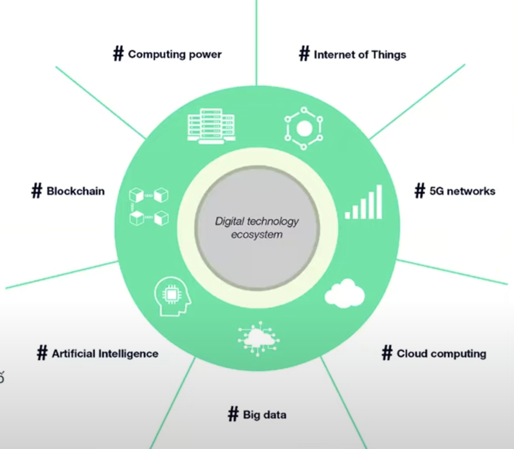

## Blockchain Basic
-   Blockchain là một sổ cái phân tán, lưu trữ các dữ liệu quan trọng (
    dữ liệu, thông tin giao dịch, số dư ,… )
-   Tất cả dữ liệu này sẽ được lưu trên các Nodes (" các máy tính tham
    gia đóng góp cho mạng lười ")
-   Tất cả các node làm việc cùng nhau, sử dụng một bộ phầm mềm và quy
    tắc chung, để xác minh giao dịch và thêm dữ liệu vào ledger.

## Blockchain's Benefits
-   Security
-   Immutability ( Only-Append )
-   Transparency
-   Composability
-   Efficiency
-   Trust
-   Low Cost

## Blockchain toàn năng?
-   Nó có phù hợp với hoàn cảnh sử dụng?

