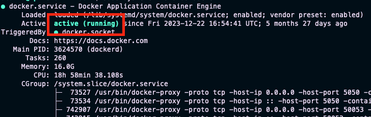

-   [Install Algokit](#install-algokit)
-   [Kiểm tra](#kiểm-tra)
-   [Start a LocalNet](#start-a-localnet)

# Install Algokit

``` bash
pipx install algokit
```

# Kiểm tra

``` bash
algokit --version
```

-   Kết quả trả về nếu đã cài đặt thành công

    ``` example
    algokit, veion 2.1.0
    ```

# Start a LocalNet

-   Check Docker

``` bash
sudo systemctl status docker
```

-   Kết quả



``` bash
algokit localnet start
```

-   Check Localnet

``` bash
docker ps
```

-   Example output

``` example
CONTAINER ID   IMAGE                     COMMAND                  CREATED              STATUS              PORTS                                                                                        NAMES
f6e16bfe8654   algorand/indexer:latest   "docker-entrypoint.s…"   About a minute ago   Up About a minute   0.0.0.0:8980->8980/tcp                                                                       algokit_sandbox_indexer
8e2026bde726   algorand/conduit:latest   "docker-entrypoint.sh"   About a minute ago   Up About a minute                                                                                                algokit_sandbox_conduit
899a7107ada6   algorand/algod:latest     "/node/run/run.sh"       About a minute ago   Up About a minute   4160/tcp, 9100/tcp, 0.0.0.0:9392->9392/tcp, 0.0.0.0:4002->7833/tcp, 0.0.0.0:4001->8080/tcp   algokit_sandbox_algod
0a4ed72edcba   postgres:16-alpine        "docker-entrypoint.s…"   About a minute ago   Up About a minute   0.0.0.0:5443->5432/tcp                                                                       algokit_sandbox_postgres
```
